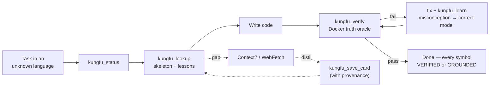
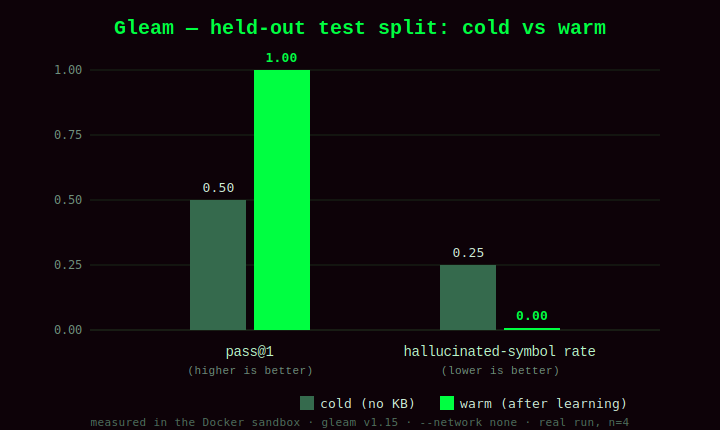

<p align="center">
  
</p>

<p align="center">
  <a href="LICENSE"></a>
  
  
  
  
  
</p>

> *"I know kung fu."* — *"Show me."*

**I Know KungFu** is a [Claude Code](https://docs.claude.com/en/docs/claude-code) plugin that lets Claude write **correct code in programming languages it does not know** — niche or brand‑new languages, DSLs, post‑training‑cutoff library versions — and, crucially, **never pretend** to. It is an **anti‑hallucination** layer for LLM code generation: every symbol is grounded in real documentation or proven by a real compiler in a Docker sandbox, and every mistake becomes a lesson it recalls next time.

It ships an **MCP server**, a self‑improving per‑language **knowledge base**, an **honesty gate** (hooks), and a **benchmark** that measures its own learning curve.

---

## What if I told you…

…that when you ask an LLM for code in a language it never really learned, its failure mode is **confident fabrication**: it pattern‑matches plausible‑but‑nonexistent syntax and APIs from languages it *does* know. Telling a model "don't make things up" barely helps. Only two things reliably stop fabrication:

- **Grounding** — back every claim with a real, cited source.
- **Execution** — run the compiler; it is the one oracle that cannot be faked.

This plugin is built entirely around those two forces.

## The idea: epistemic honesty

> *"There is no spoon."* — and there is no faking it.

Every symbol Claude writes carries an **epistemic state**, and behavior is gated by it:

| State | Means | May ship as "done"? |
| --- | --- | --- |
| **VERIFIED** | Compiled / ran in the sandbox | ✅ highest trust |
| **GROUNDED** | Backed by a cited source it fetched | ✅ but marked not‑yet‑run |
| **HYPOTHESIS** | A guess pattern‑matched from another language | ❌ promote or disclose |

**The one rule: no HYPOTHESIS survives to completion.** It is promoted to GROUNDED (fetch real docs) or VERIFIED (compile it), or the user is told plainly that it is unverified and why. That sentence — *"these symbols are verified, these are grounded, I have no basis for anything else"* — is the product.

## How it works — four loops



| Loop | What it does |
| --- | --- |
| **Retrieve** | Fetch real syntax/library docs (Context7 + WebFetch), shard per language under `~/.kungfu`, load only what's needed. Records **negative knowledge** — what does *not* exist. |
| **Verify** | Compile / type‑check / test generated code in a locked Docker sandbox. If Docker is down, it says so — it never fakes a pass. |
| **Learn** | Turn each mistake into a **misconception → correct‑model** lesson, keyed by the flawed reasoning so it is recalled the next time that reasoning recurs. Recurring lessons roll up into a structural **skeleton** of the language. |
| **Measure** | A held‑out benchmark scores competence **cold** (empty KB) vs **warm** (after learning) and renders a learning curve. Never reports faked numbers. |

> *"I can only show you the door. You're the one that has to walk through it."*

The MCP server is the **librarian**, not the brain: it stores, retrieves, verifies, and benchmarks, and it **never calls an LLM**. All judgment — what to fetch, how to distil, what to write — stays with Claude.

## The proof: it measurably learns

Most "self‑improving" claims are vibes. This one is measured in the real compiler.

<p align="center">
  
</p>

On a held‑out set of Gleam tasks, going from an empty knowledge base to one that has learned the language's fold idiom:

| metric | cold (no KB) | warm (after learning) | delta |
| --- | --- | --- | --- |
| pass@1 | 0.50 | 1.00 | **+0.50** ✅ |
| hallucinated‑symbol rate | 0.25 | 0.00 | **−0.25** ✅ |

The mistakes the sandbox caught are the exact cross‑language carry‑overs an LLM makes — `list.fold_left` (from OCaml/Elm — doesn't exist in Gleam) and `list.reduce` with the wrong arity (from JS/Python). Full methodology, the audited candidate solutions, and reproduce steps are in **[BENCHMARK.md](BENCHMARK.md)**.

## Install

> *"Welcome to the real world."*

Prerequisites: **Python 3.11+**, [**uv**](https://docs.astral.sh/uv/), and **Docker** (for verification; the plugin degrades honestly without it).

```text
/plugin marketplace add emircbngl/claude-i-know-kungfu
/plugin install i-know-kungfu@i-know-kungfu-marketplace
```

The MCP server starts automatically via `.mcp.json` (`uv` resolves dependencies on first run). The knowledge base bootstraps itself at `~/.kungfu` on first use.

## Quickstart

```text
/kungfu-status gleam              # what's known? is the verifier up?
/kungfu-teach gleam               # cold-start: fetch docs, distil a skeleton, verify seeds
"write a Gleam function that …"   # the skill drives: lookup → write → verify → learn
/kungfu-bench gleam selfcheck     # sanity-check the suite + sandbox
```

Then the headline:

```text
/kungfu-bench gleam cold          # solve held-out tasks with no KB
/kungfu-bench gleam warm          # learn from the train split, then re-solve
/kungfu-bench gleam report        # write the cold-vs-warm learning curve to BENCHMARK.md
```

### MCP tools

`kungfu_status` · `kungfu_lookup` · `kungfu_save_card` · `kungfu_verify` · `kungfu_learn` · `kungfu_bench`

## Knowledge base layout (`~/.kungfu`, personal, never committed)

```text
knowledge/<lang>/
  _index.md            # manifest (a view, recomputed from files)
  skeleton.md          # structural model + negative knowledge + learned rules
  syntax/<topic>.md    stdlib/<module>.md    libraries/<lib>@<ver>.md
  lessons.jsonl        # data: misconception → correct-model lessons
  lessons.md           # human-readable view of the above
```

Files are the source of truth; every `.md` index is a regenerated view. Retrieval is manifest‑first — it never loads a whole language. All writes are atomic (temp + `os.replace`).

## Design notes (honest about prior art)

This builds on established ideas — retrieval‑augmented generation (RAG), self‑repair / self‑debugging loops, reflexion‑style memory, and Context7 documentation retrieval. What's novel is the *integration into one epistemically‑honest agent*: lessons grounded in **verified execution** and keyed by the **misconception** (not a string), an explicit **epistemic‑state gate** that blocks ungrounded output, **negative knowledge** as a first‑class anti‑hallucination tool, and a **measured learning curve**. "Self‑training" here means a growing external knowledge base — **not** changes to model weights.

## Status & limitations

- **Validated end‑to‑end on a Docker host.** The Gleam sandbox builds (`ghcr.io/gleam-lang/gleam:v1.15.0-erlang-alpine`), the held‑out suite self‑checks 4/4, and the cold→warm run produces the curve above. Verification runs offline (`--network none`).
- Pure logic (knowledge store, learn engine, verifier control flow, benchmark harness) is covered by a unit‑test suite: `uv run --extra dev pytest` → **37 passing**. The codebase also passed a max‑effort multi‑agent self‑review (14 findings fixed).
- **Honesty holds in the failure path:** with Docker stopped, `kungfu_verify` returns a structured "cannot verify" and the bench marks runs not measurable — it never fakes a pass or invents numbers.
- *Limitations:* the benchmark is a mechanism demonstration (n = 4 held‑out tasks, one language) whose cold/warm candidate solutions are documented and human‑audited (see BENCHMARK.md), not produced by a blind cold model. Gleam verification covers the cached stdlib + gleeunit offline; projects needing other hex packages require `docker.network: "bridge"`. Bump the Gleam image tag as releases land.

## Repository layout

```text
.claude-plugin/    plugin.json, marketplace.json
.mcp.json          wires the kungfu MCP server
hooks/             honesty-gate hooks + gate.py
skills/            i-know-kungfu/SKILL.md + references/
commands/          /kungfu-* commands
server/            FastMCP server (kungfu/), Docker sandboxes, bench suite, tests
assets/            banner + learning-curve visuals
```

## Keywords

Claude Code plugin · MCP server · anti‑hallucination · LLM code generation · grounding · retrieval‑augmented generation · Docker sandbox verification · self‑improving agent · epistemic honesty · learn from mistakes · unknown programming languages · Gleam · FastMCP · Anthropic Claude.

## License

MIT © 2026 [emircbngl](https://github.com/emircbngl)

> *"Free your mind."*
