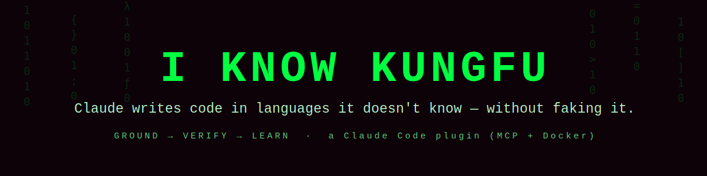

<p align="center">
  
</p>

<p align="center">
  <a href="LICENSE"></a>
  
  
  
  
  
</p>

> *"I know kung fu."* — *"Show me."*

**I Know KungFu** is a [Claude Code](https://docs.claude.com/en/docs/claude-code) plugin that makes Claude **prove its code instead of trusting its memory** — and **never pretend** to know. When Claude writes a language or API it is unsure of, the plugin grounds every symbol in real documentation, compiles/tests it in a Docker sandbox, and turns each genuine mistake into a lesson it recalls next time. It is an **anti‑hallucination / verification layer** for LLM code generation.

It ships an **MCP server**, a self‑improving per‑language **knowledge base**, an **honesty gate** (hooks), and a **benchmark harness** with an honestly‑reported evaluation (see [below](#what-a-real-evaluation-actually-showed) and [BENCHMARK.md](BENCHMARK.md)).

---

## What if I told you…

…that when you ask an LLM for code in territory it never really learned — a niche language, a post‑training‑cutoff API, an obscure library — its failure mode is **confident fabrication**: plausible‑but‑nonexistent syntax invented from languages it *does* know. Telling a model "don't make things up" barely helps. Only two things reliably stop fabrication:

- **Grounding** — back every claim with a real, cited source.
- **Execution** — run the compiler; it is the one oracle that cannot be faked.

This plugin is built entirely around those two forces.

## The idea: epistemic honesty

> *"There is no spoon."* — and there is no faking it.

Every symbol Claude writes carries an **epistemic state**, and behavior is gated by it:

| State | Means | May ship as "done"? |
| --- | --- | --- |
| **VERIFIED** | Compiled / ran in the sandbox | ✅ highest trust |
| **GROUNDED** | Backed by a cited source it fetched | ✅ but marked not‑yet‑run |
| **HYPOTHESIS** | A guess pattern‑matched from another language | ❌ promote or disclose |

**The one rule: no HYPOTHESIS survives to completion.** It is promoted to GROUNDED (fetch real docs) or VERIFIED (compile it), or the user is told plainly that it is unverified and why. That sentence — *"these symbols are verified, these are grounded, I have no basis for anything else"* — is the product.

## How it works — four loops


| Loop | What it does |
| --- | --- |
| **Retrieve** | Fetch real syntax/library docs (Context7 + WebFetch), shard per language under `~/.kungfu`, load only what's needed. Records **negative knowledge** — what does *not* exist. |
| **Verify** | Compile / type‑check / test generated code in a locked Docker sandbox. If Docker is down, it says so — it never fakes a pass. |
| **Learn** | Turn each mistake into a **misconception → correct‑model** lesson, keyed by the flawed reasoning so it is recalled the next time that reasoning recurs. Recurring lessons roll up into a structural **skeleton** of the language. |
| **Measure** | A blind‑agent benchmark harness that scores solutions in the sandbox and reports **honest numbers — including null results.** No staged curves. |

> *"I can only show you the door. You're the one that has to walk through it."*

The MCP server is the **librarian**, not the brain: it stores, retrieves, verifies, and benchmarks, and it **never calls an LLM**. All judgment — what to fetch, how to distil, what to write — stays with Claude.

## What a real evaluation actually showed

> *"Welcome to the real world."*

The honest part. I ran a **controlled blind‑agent evaluation**: **10 identical tasks × 3 languages × 3 samples = 90** one‑shot solutions, each written by a fresh agent from its **own knowledge only** (no KB, no lookup, no web). Same problem and examples in every language — only the signature changes — so the one variable is the language. Every solution was scored against hidden tests by the real compiler in a `--network none` Docker sandbox. Full data (all 90 solutions + diagnostics) is committed at [`server/bench/suite10_eval.json`](server/bench/suite10_eval.json).

| cold pass@1 | Gleam | Julia | Oberon‑07 | overall |
| --- | --- | --- | --- | --- |
| 9 classic tasks (sum/gcd/fib/prime/…) | 26/27 | 27/27 | 26/27 | — |
| **`eval_expr` — a precedence + parens parser** | **3/3** | **3/3** | **0/3** | — |
| **all 10 tasks** | **29/30** | **30/30** | **26/30** | **85/90 (94%)** |

**After feeding each cold failure its real compiler error once or twice — `kungfu_verify`, no knowledge base — 90/90.**

**Two honest findings:**

1. **Where the model is already good, the plugin adds nothing — and the repo says so.** 85 of 90 solutions passed cold, in three niche languages, with no help. (An earlier README staged a `0.50 → 1.00` curve from hand‑picked failures; it was removed — faking a number is what this project opposes.)

2. **The gap is a *language trap*, not difficulty — and execution feedback closes it.** The five cold failures concentrate: four in Oberon‑07, three of them the *same* task — a recursive‑descent expression parser that is **3/3 in Gleam, 3/3 in Julia, 0/3 in Oberon.** Same mutual recursion in all three; but Oberon‑07 has **no forward declarations**, forbids calling a **sibling** nested procedure, and requires `RETURN` to be a body's last statement — rules a model pattern‑matching from C/Rust violates. Feed each failure its real compiler error and every one recovers (the Oberon fix is the true idiom: module‑level state + a procedure‑typed variable). **85/90 → 90/90**, on the compiler alone. Corroborates an earlier focused run on the same parser task (Oberon 1/6 cold → 5/6 with the loop).

That second finding is the whole thesis in one line: **the plugin earns its keep exactly where the model struggles — and it's execution feedback, not trust, that fixes it.**

## Install

Prerequisites: **Python 3.11+**, [**uv**](https://docs.astral.sh/uv/), and **Docker** (for verification; the plugin degrades honestly without it).

```text
/plugin marketplace add emircbngl/claude-i-know-kungfu
/plugin install i-know-kungfu@i-know-kungfu-marketplace
```

The MCP server starts automatically via `.mcp.json` (`uv` resolves dependencies on first run). The knowledge base bootstraps itself at `~/.kungfu` on first use.

## Quickstart

```text
/kungfu-status gleam              # what's known? is the verifier up?
/kungfu-teach gleam               # cold-start: fetch docs, distil a skeleton, verify seeds
"write a Gleam function that …"   # the skill drives: lookup → write → verify → learn
/kungfu-verify gleam <files>      # compile/test it in the sandbox — the truth oracle
/kungfu-bench gleam selfcheck     # sanity-check the suite + sandbox
```

### MCP tools

`kungfu_status` · `kungfu_lookup` · `kungfu_save_card` · `kungfu_verify` · `kungfu_learn` · `kungfu_bench`

## Knowledge base layout (`~/.kungfu`, personal, never committed)

```text
knowledge/<lang>/
  _index.md            # manifest (a view, recomputed from files)
  skeleton.md          # structural model + negative knowledge + learned rules
  syntax/<topic>.md    stdlib/<module>.md    libraries/<lib>@<ver>.md
  lessons.jsonl        # data: misconception → correct-model lessons
  lessons.md           # human-readable view of the above
```

Files are the source of truth; every `.md` index is a regenerated view. Retrieval is manifest‑first — it never loads a whole language. All writes are atomic (temp + `os.replace`).

## Design notes (honest about prior art)

Builds on established ideas — retrieval‑augmented generation (RAG), self‑repair / self‑debugging loops, reflexion‑style memory, and Context7 documentation retrieval. What's distinctive is the *integration into one epistemically‑honest agent*: lessons grounded in **verified execution** and keyed by the **misconception** (not a string), an explicit **epistemic‑state gate** that blocks ungrounded output, **negative knowledge** as a first‑class anti‑hallucination tool, and a benchmark that **reports honest numbers — null where the model needs no help, a real delta where it does — instead of staging wins**. "Self‑training" means a growing external knowledge base — **not** changes to model weights.

## Status & limitations

- **Verification works end‑to‑end on a Docker host.** Sandboxes for **Gleam, Julia, and Oberon** (the last builds the OBNC compiler from source) build and self‑check offline (`--network none`).
- Pure logic (knowledge store, learn engine, verifier control flow, benchmark harness) is covered by a unit‑test suite: `uv run --extra dev pytest` → **38 passing**. The codebase also passed a max‑effort multi‑agent self‑review (14 findings fixed).
- **Honesty holds in the failure path:** with Docker stopped, `kungfu_verify` returns a structured "cannot verify" and the bench marks runs not measurable — it never fakes a pass or invents numbers.
- **Where the plugin helps — measured, not asserted.** Across 90 blind runs (10 identical tasks × 3 languages × 3 samples), the model passes **85/90 cold** — so on tasks it already knows, no pass@1 uplift, and the repo says so. The gap concentrates in one place: an Oberon‑07 recursive‑descent parser that hits the no‑forward‑declarations trap (**0/3 cold**). The verify‑fix loop closes the whole gap on execution feedback alone: **85/90 → 90/90**. The value is verification + honesty + closing that gap, not making the model able to do what it already can.

## Repository layout

```text
.claude-plugin/    plugin.json, marketplace.json
.mcp.json          wires the kungfu MCP server
hooks/             honesty-gate hooks + gate.py
skills/            i-know-kungfu/SKILL.md + references/
commands/          /kungfu-* commands
server/            FastMCP server (kungfu/), Docker sandboxes, bench suite, tests
assets/            banner
```

## Keywords

Claude Code plugin · MCP server · anti‑hallucination · LLM code generation · grounding · retrieval‑augmented generation · Docker sandbox verification · code verification · epistemic honesty · learn from mistakes · FastMCP · Anthropic Claude.

## Star history

<a href="https://star-history.com/#emircbngl/claude-i-know-kungfu&Date">
  
</a>

## License

MIT © 2026 [emircbngl](https://github.com/emircbngl)

> *"Free your mind."*
